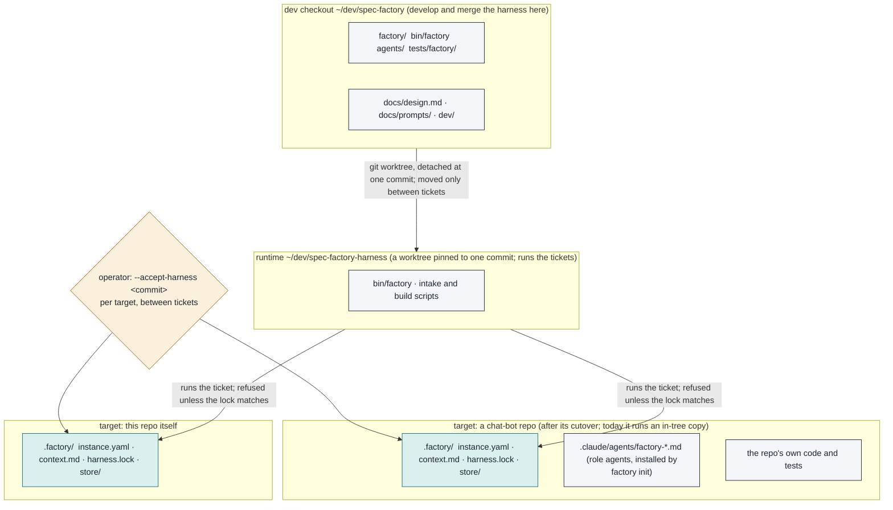

# Spec Factory

An AI software pipeline: eight agent roles, a harness that enforces the wiring rules, a routing
table, and human gates. This page is the system as it runs today; install and use are in
"Where it runs" and "Starting a run".

| | |
|---|---|
| **Status** | Current state as of 2026-10-04. Intake works end to end. Build works, in local-only mode. |
| **Reader** | Technical, seeing this project for the first time. Terms specific to this system are defined where they first appear. |
| **Scope** | What runs now. The intended design and its reasoning are in `docs/design.md`; where the two disagree, this page is right about what runs and the design is amended. |
| **Internal references** | Ticket ids, issue numbers and who did what are in "Related work and history" near the end. |

## What problem it solves

Coding agents are good at writing code and bad at knowing when to stop, what to check, and whether
what they built is what was asked for. Left alone, one agent writes the spec, the code, the tests
and the review of its own work. Every check it passes is a check it also wrote.

The spec factory splits that work across several agents that never share a context. A program
sits between them and enforces who sees what and what counts as done. A human decides at a few
fixed points. The output is code merged into a branch, with a record of what was asked, what was
built, who checked it against what, and why it was allowed through.

## Roles, harness, workflows

**Roles.** Eight jobs, each a prompt. A role runs as a fresh agent every time and sees only its
declared inputs: the critic never sees the writer's reasoning, the reviewer never sees the
implementer's.
Every role's input carries a wrapper that runs a command with a fresh temporary HOME, and the repo's check commands come already wrapped.
It does not stop a write to an absolute path.

| Role | Does | Model |
|---|---|---|
| Triage | decides whether a request is a real ticket, and for what | Opus |
| Spec writer | turns it into a spec whose acceptance items are commands with expected results | Opus |
| Spec critic | judges the spec against a six-item rubric | Fable |
| Planner | splits an approved spec into sub-tickets that can each be one merge | Opus |
| Implementer | builds one sub-ticket on its own branch | Opus |
| Code reviewer | judges the diff against the spec's intent | Fable |
| Verifier | runs the acceptance items and the repo's own test gates on the result | Opus |
| Retro | reads what went wrong and proposes rule changes (not yet built) | Fable |

**The harness.** A small program, `bin/factory` (the Python package `factory/`). It owns the
records and the rules. Its records are the **store**: one file per ticket with its state; one
directory per role run with exactly what the role was given and what it returned; every version of
every spec; each checker's verdict keyed to the commit it judged; an append-only log. Its rules are
the ones a prompt cannot enforce: which state a ticket may move to next (the **routing table**),
how many author-and-checker rounds are allowed before a human is pulled in (two), and that nothing
merges without the right verdicts on the current commit.

**Two workflow scripts.** *Intake* takes a ticket from request to approved spec. *Build* takes it
from approved spec to merged, verified code. Each decides which role runs next from the `STATUS:`
line the previous role ended with, and from nothing else.

**How it is driven.** Nobody runs the roles by hand. A Claude Code session runs a workflow script
through its Workflow tool, and the script calls each role as a separate agent. The script cannot
read or write files. Every time it needs the store it asks a small **clerk** agent (Haiku) to run
one `bin/factory` command and return the JSON. A run therefore has far more agent calls than roles;
most are the clerk relaying records. The harness, not the clerk and not the script, decides whether
a command is allowed.

## Terms used on this page

| Term | Meaning |
|---|---|
| ticket | one request, from a file to a closed record; ids like `T-0012` |
| sub-ticket | one independently mergeable piece of a planned ticket; `T-0012.4` |
| gate | a point where a human must decide before the pipeline continues |
| parked | the pipeline has stopped a ticket and is waiting for a human |
| round | one pass by a checker; the spec and the code each get two before a human is asked |
| integration branch | the branch finished sub-tickets are merged into; `main` here |
| current truth | one document per capability saying what the system does now; the pipeline keeps it |
| target | a repo the factory works on |
| instance | a target's `.factory/` directory: its config, its briefing for the roles, its store |
| store branch | `factory-store`, the target's branch for its store; checked out as a git worktree at the store's path and never merged into the integration branch |
| runtime | the pinned checkout of the harness that runs tickets; distinct from the dev checkout |

## How a ticket moves

Someone puts a request in a file and runs `factory ticket new`. The harness assigns an id and the
state "ready for triage". The intake workflow runs triage. On accept, the spec writer investigates
the repo and writes the spec. The critic judges it and approves, asks for a revision (at most
twice), or escalates. On approve, the ticket waits at the **spec gate**. A human reads the spec,
edits it if needed, and approves it (pinning that version) or sends it back with notes. Nothing
downstream runs until this happens.
The intake script stops at the spec gate; the build script plans the work.

The build workflow first asks the harness whether the spec needs splitting (`factory plan
whole-spec`). When it needs only one sub-ticket, the harness creates that sub-ticket from the whole
spec, naming every scenario in it, and no planner runs. A spec needs only one when the spec writer
did not mark it too large for one merge (`NEEDS-SPLIT`), no heading in it names seams (the places
the writer says the work splits), and no planner has run on it before. Otherwise the planner runs,
splitting the spec into sub-tickets with dependencies. The one-sub-ticket path is tested, and has
not yet run on a real ticket.
When a sub-ticket's dependencies are merged, an implementer builds it on a branch in its own
working copy. The reviewer and the verifier then judge the same commit, independently. The harness
makes one decision from their verdicts: merge; send back for a revision (at most twice); send back
to merge in a `main` that moved; or park for a human. A merge is a local `--no-ff` merge of the
judged commit into the integration branch, one merge at a time.

When every sub-ticket has merged, one more verifier run checks the whole spec against the
integration branch. That final run is skipped when the spec had one sub-ticket, that sub-ticket
was told to check every acceptance scenario of the spec (a command with its expected output), and
the integration branch has not moved since it merged: the sub-ticket's verifier already checked
the same code against the same starting point. On success the harness folds the spec into current truth and closes the
ticket. If the target has no spec store yet (no `openspec/` tree), the fold is refused and the
ticket parks; the human then closes it as applied with `resolve --close`, and current truth is
not updated. While that final run is in progress, the ticket's record lists it as in flight, like
any other run.

At any step a role can say it needs a human: a question, an escalation, a blocked build. The
harness parks the ticket. So does running out of rounds, or a run exceeding its budget. A human
unsticks it with `factory resolve`, and the ticket re-enters at the step the rules name.

```mermaid
flowchart LR
  classDef human fill:#fbf0dc,stroke:#9a5b00,color:#1b2430
  classDef orch fill:#f3f5f8,stroke:#1b2430,color:#1b2430
  classDef store fill:#dcefef,stroke:#0f6e73,color:#1b2430

  R[/"request file"/]:::human
  R -- "factory ticket new" --> T[("ticket<br/>ready for triage")]:::store

  subgraph I["intake workflow  (agents, driven by the script)"]
    direction LR
    TR["Triage"]:::orch -- accept --> SW["Spec writer"]:::orch
    SW -- spec --> SC["Spec critic"]:::orch
    SC -. "revise · at most twice" .-> SW
  end
  T --> TR
  SC -- approve --> G{"Spec gate: a human<br/>approves (with edits) or sends back"}:::human
  G -- "pins the spec version" --> P2[("ready for planning")]:::store

  subgraph B["build workflow  (agents, driven by the script)"]
    direction LR
    PL["Planner"]:::orch -- "sub-tickets" --> IM["Implementer<br/>own branch and working copy"]:::orch
    IM -- "one commit" --> RV["Reviewer<br/>reads the diff"]:::orch
    IM -- "one commit" --> VF["Verifier<br/>runs acceptance + test gates"]:::orch
    RV --> J["harness decides<br/>merge · revise · catch up with main · park"]:::store
    VF --> J
    J -. "revise · at most twice" .-> IM
    J -- merge --> M["local --no-ff merge<br/>into the integration branch"]:::store
    M -- "every sub-ticket merged" --> PC["Verifier<br/>whole spec on the integration branch"]:::orch
    PC -- verified --> AR[("spec folded into current truth<br/>ticket closed")]:::store
  end
  P2 --> PL

  CL["clerk agent<br/>runs one bin/factory command per record"]:::orch
  I -. "every record" .-> CL
  B -. "every record" .-> CL
  CL --> ST[("the store<br/>tickets · runs · specs · verdicts · log · current truth")]:::store

  PK{"parked ticket<br/>a human runs factory resolve"}:::human
  TR & SW & SC & PL & IM & J & PC -. "needs a human · out of rounds · over budget" .-> PK
```



*One ticket from request file to closed record. Orange is the human; grey is the agents; teal is
the store. Dashed edges are the bounded loops, the routes to a human, and the clerk relay.*

## Where it runs

Three places:

- The **dev checkout**, `~/dev/spec-factory`. The harness is developed and merged here. It is also
  a target, because the factory works on itself.
- The **runtime**, `~/dev/spec-factory-harness`. A second checkout of the same repo, a git worktree
  detached at one commit. This is what runs tickets. It stands still until an operator moves it,
  between tickets, so a merge into `main` can never change the code under a ticket that is
  mid-run.
- Each **target** holds only a `.factory/` directory, its instance: `instance.yaml` (config),
  `context.md` (the briefing every role reads first), the store, and `harness.lock`, the one
  harness commit this target has agreed to run with. The store is the target's record of every
  ticket. A store that `factory init` creates is a git worktree of the store branch,
  `factory-store`, at a path the integration branch has never tracked, so committing the store
  never moves the integration branch. This repo's store and the chat-bot repo's predate that. Each
  is a plain directory committed on its integration branch until its operator moves it onto its
  branch, at `.factory/store`, with `factory store migrate`. Today this repo is the only
  target on the runtime; a chat-bot repo is a target that still runs its own in-tree copy of the
  harness until its cutover.



*One runtime serves every target. A target runs only the harness commit its lock names.*

**How the harness finds a target.** From any directory inside the target it walks up to the
nearest `.factory/instance.yaml`, or takes `FACTORY_INSTANCE`. `instance.yaml` names the runtime,
the store, the protected paths and the repo's test gates. `FACTORY_STATE` names a store to use
instead, and `FACTORY_REPO` a repo root. A relative `FACTORY_INSTANCE`, `FACTORY_STATE` or
`FACTORY_REPO` is taken from the directory the command runs in.

### Accepting a harness revision

Before any command touches a target's own store, the harness compares the runtime's commit with
the commit in that target's `harness.lock`. If they differ, the command is refused. The message
names both commits and the flag. This is the lock doing its job: the runtime was moved and this
target has not yet agreed to the new revision.

To agree, run the first command against that target with `--accept-harness <sha>`, where `<sha>`
is the runtime's current commit (40 hex). The harness rewrites the lock and logs the acceptance in
the target's store. The flag is not needed again until the next move. It is per target: one repo
can accept a revision while another stays on the old one.

The flag cannot clear the other refusal. A runtime with uncommitted edits to the harness code is
refused outright; commit or discard them first. Both checks apply only when a command uses the
instance's own store. A throwaway store (`FACTORY_STATE` pointing elsewhere, as every test does)
skips them.

### Upgrading the runtime

Between tickets, never during one:

1. Move the runtime: `git -C ~/dev/spec-factory-harness checkout --detach <sha>`, then
   `uv sync --frozen` there.
2. In each target that should adopt it, run any store command once with `--accept-harness <sha>`.

Targets you do not touch keep running the revision they accepted.

### Installing the harness

Once per machine. `H` is the dev checkout; the runtime is a worktree of it.

```
git clone <this repo> ~/dev/spec-factory
cd ~/dev/spec-factory && uv sync --frozen
uv run --frozen pytest -q -p no:cacheprovider tests/factory      # the harness's own suite
git worktree add --detach ~/dev/spec-factory-harness main
uv sync --frozen --project ~/dev/spec-factory-harness
```

`uv sync` gives the harness its interpreter and dependencies (`pyproject.toml`, `uv.lock`);
`bin/factory` runs the `factory` package with that environment. The runtime is what targets run;
the dev checkout is where you merge.

### Adopting the factory in a repo

From inside the target repo, with `R` the runtime (`~/dev/spec-factory-harness`):

1. `$R/bin/factory init --repo-name NAME`, from the repository root. Creates `.factory/` at the
   repo's top level (`instance.yaml`, `context.md`, `harness.lock`) and copies the role agents into
   `.claude/agents/`. It creates the store as a checkout of a new `factory-store` branch, and adds
   the store's path to the repo's git exclude file so the integration checkout does not see it.
   On a clone where `factory-store` already exists, locally or on one remote, it checks that
   branch out instead, which restores the store. When more than one remote carries the branch it
   refuses and names each; pick one with `git branch factory-store <remote>/factory-store` and run
   `init` again. It also refuses from inside the store, and at a store path the integration branch
   has ever tracked. Idempotent.
2. Restart the Claude Code session so the agents register.
3. Fill in `.factory/context.md`, the briefing every role reads first: which repo this is, how to
   run its tests, what kind of request to expect. Set `gate_commands` and `protected_paths` in
   `.factory/instance.yaml`. A `gate_commands` entry may declare `paths`, the git pathspecs the
   command covers: `{command: "<command>", paths: [":(exclude)dev/"]}`. A sub-ticket whose changes
   touch none of them skips that command. Prefer exclude pathspecs, so a new file still runs the
   command. Set `run_env` for any tool whose cache lives under HOME,
   so it still finds that cache from inside the fresh temporary HOME.

The repo is now a target. "Starting a run" is the rest.

### Committing and pushing the store

The store is its own checkout of `factory-store`, so its records are committed there, never on the
integration branch. Set `S` to the store's path (`state_dir` in `instance.yaml`; `.factory/state`
for a new instance), then:

```
git -C "$S" add -A && git -C "$S" commit -m "store: <what changed>"
git push origin factory-store
```

A store commit never moves the integration branch, so it never sends a sub-ticket that is waiting
to merge back for a catch-up run.

Two cautions:

- In the integration checkout, `git clean -fdx` keeps the store, because git skips a directory
  that holds its own `.git`. `git clean -ffdx`, with a doubled `-f`, deletes it, uncommitted
  records included.
- Run `factory init` from the repository root. From inside the store it refuses, because there
  it would build a second instance inside the live store.

### Moving an existing store onto its branch

A store made before the store branch existed is a plain directory committed on the integration
branch, at `.factory/state`. `factory store migrate` moves it onto `factory-store`, checked out at
a new path. The new path must be one the integration branch has never tracked, because at the old
path a checkout of an older commit would overwrite the live records.

Before you start, all of these must hold. The command checks each one. If one fails, it refuses,
changes nothing, and names the runs, worktrees or files in the way.

- No ticket has a run in flight.
- No implementer worktree or checker checkout lies under the store.
- Every store file is committed on the integration branch, and that branch is checked out at the
  repository root.
- No `factory-store` branch exists yet, and nothing exists at the new path.

From the repository root, with `R` the runtime:

```
$R/bin/factory store migrate --to .factory/store
```

The command does six things, in this order:

1. It starts `factory-store` at one commit holding the store as last committed. The commit's
   message names the integration-branch commit it came from. The store's earlier history stays
   readable there, with `git log <that commit> -- .factory/state`.
2. It checks the branch out at `.factory/store`.
3. It copies the files git ignores (run scratch directories, tripwire baselines) to the same place
   under the new path.
4. It checks the copy byte for byte. If anything differs, it removes the new checkout and the branch
   and exits 1, and the old store is as it was.
5. Only then does it untrack and delete `.factory/state`, add `/.factory/store/` to the repo's git
   exclude file, and set `state_dir` in `instance.yaml` to the new path.
6. It logs the move in the moved store and prints what it did.

It commits nothing and pushes nothing. Review the integration-branch side, then commit both sides
and push both branches:

```
git status                      # .factory/state deleted, state_dir changed
git commit -a -m "store moved to its branch"
git -C .factory/store add -A && git -C .factory/store commit -m "store: moved to its branch"
git push origin <integration branch> factory-store
```

A checkout of a commit from before the move, in the integration checkout, brings back the old
`.factory/state` and an `instance.yaml` whose `state_dir` names it. Commands run during that
checkout use that stale copy, not the store. Checking the integration branch out again removes it.
The moved store is untouched throughout.

To roll back, with no run in flight and the store committed:

1. Detach the checkout: `rm .factory/store/.git && git worktree prune`. Never use
   `git worktree remove`, which deletes the directory.
2. Move the directory back (`mv .factory/store .factory/state`) and `git add .factory/state` on the
   integration branch.
3. Set `state_dir` back to `.factory/state`, and remove the `/.factory/store/` line from the exclude
   file, whose path `git rev-parse --git-path info/exclude` prints.

## Starting a run

A Claude Code session in the target repo asks the runtime where things are:

```
$RUNTIME/bin/factory paths      # the harness, its entry point, both workflow scripts,
                                # the running revision, the instance and its store
```

It then calls the Workflow tool with `scriptPath` set to the intake script and args
`{ticket, repo: <runtime>, instance: <.factory>}`. After the gate, the same call with the build
script. Add `inlineRoles: true` on every target for now: `agents/` ships agent definitions only for
the intake roles, so a build without it fails at the first implementer call (#24). With it, roles
read their prompt from the run's `system-prompt.txt`, and run without per-role tool limits. Start the
build script after the spec gate; the intake script has nothing to do past it.

### Running many tickets: runner and operator sessions

Keep deciding and running in different Claude Code sessions.

| Session | Does | Does not |
|---|---|---|
| Operator session | Talks with the human: gate approvals, acceptance tests, rulings, priorities | Launch workflows or read run output |
| Runner session, one per target | Launches workflows, recovers stopped tickets, sends harness problems to the session that owns the harness | Make the human's decisions |

Why it matters: an agent the workflow starts never sees either session's conversation. Each launch
and each completion notice, though, is a turn of the session that launched it, and that turn re-reads
the session's whole history. A long decision conversation that also dispatches pays for its own
length on every one of those turns. The Nanobot port runs this way: its runner (the "Driver" session)
reports harness problems to the session that owns this repo, which fixes them through tickets here.

**Parallel intake works today.** Start one intake per ticket from a runner. Tickets share only the
store, and every store write goes through `bin/factory`, which allocates run ids atomically. On
2026-10-04 the two stores had 41 and 11 overlapping runs of different tickets (triage, spec writers,
critics, planners). Each run has its own scratch directory in the store for its temporary files,
cleared when its ticket moves on and kept while it is parked; this is tested but has not yet run on a
real ticket.

**Parallel builds across tickets have not been tried.** Each sub-ticket builds in its own worktree,
merges into the integration branch one at a time under a lock, and gets a catch-up run if the branch
moved under it. Two builds at once also move the branch under each other, which costs catch-up runs.
A store committed on its store branch no longer moves the integration branch. Until a real run
shows the cost, run one build at a time per target.

**Moving the runtime** happens only when no build is in flight on any target, because every target
runs from the same runtime. Each target's runner then accepts the new revision between its builds.

## Where a human decides

**While a run is in flight, put `FACTORY_DISPATCH=1` in front of every store write you make.**
A run is in flight from `run start` until `run finish` records its result. While any run on a
target is in flight, the harness refuses every write to that target's store that lacks this
marker. A write is any command except `ticket show`, `ticket join`, `results show`, `config`,
`status parse`, `log tail` and `paths`; a command given `--accept-harness` is always a write. The
workflow scripts already put the marker on their own commands. Put it in front of one command at
a time:

```
FACTORY_DISPATCH=1 $RUNTIME/bin/factory decision add T-n "<line>"
```

Without the marker the write is refused with exit 2, and nothing is written. The refusal text
deliberately does not name the marker, so that a role reading it is not told how to get past it.
Its advice to "use a throwaway FACTORY_STATE" is meant for roles, not for you. Never export the
marker: every role run started from that shell would inherit it. Run store writes from the
repository root. From inside the store's `runs/` or `worktrees/`, where roles do their work, every
write is refused, and the marker does not help. A run left in flight by a workflow that stopped
keeps the refusal in place; clear it with:

```
FACTORY_DISPATCH=1 $RUNTIME/bin/factory run finish <run> --status-override KILLED
```

| | Command | What you decide |
|---|---|---|
| **File** | `factory ticket new --file <abs path>` | that this request is worth a ticket |
| **Gate** | `factory approve-spec T-n [--edit F]` · `factory request-changes T-n F` · close | the spec's intent, risk declarations, operator steps, "tests to change"; a gate edit becomes a new spec version and is what gets pinned |
| **Unstick** | `factory resolve T-n --answer F` (a role asked a question) · `--ruling F` (a role escalated, an implementer reported itself blocked, or the harness blocked an implementer whose sub-ticket lists a test no merged sibling added) · `--redispatch` (re-run the checks on the same commit after an outside fix) · `--replan F` (the final check failed after every sub-ticket merged: back to the planner with a note; new sub-tickets take the next free ids) · `--to spec-gate` · `--close`; with `--answer` or `--close`, add `--decision "<line>"` to also record the answer as a standing decision | an answer, a ruling, a re-check, a re-plan, a re-scope, or closing |
| **Record** | `factory decision add T-n "<line>"`, at any ticket state, closed included. It appends one dated line to the target's decision log, `decisions.md`, which the spec writer, critic and planner receive with their input | that a decision binds later tickets |
| **Upgrade** | `factory --accept-harness <sha> <command>` | that this target adopts a new harness revision |

A ticket the tripwire parked returns with a plain `ticket transition` to the state its record
names as `parked.from`, once the operator has checked the named files; a checker park can use
`resolve --redispatch` instead. Everything else is the harness's and the scripts': which role runs
next, how many rounds, what the checkers receive, when a merge is allowed, when the ticket closes.

## What is built and what is not

**Built**

- **Intake.** A request becomes a ticket. Triage accepts or routes it. The spec writer and critic
  alternate until the critic approves or two rounds are up. The ticket waits for the human at the
  gate. Every one of these runs has been real, with real models.
- **Build, local-only.** There is no remote git server, no pull request and no CI service yet. In
  their place: each sub-ticket is built on a branch in its own working copy. The verifier runs the
  repo's own check commands (`gate_commands` in `instance.yaml`: lint, tests) and records the
  result where a CI result would go. The reviewer and verifier judge the same commit. A sub-ticket
  that passes is merged into the local integration branch, one merge at a time. If `main` moved
  during the build, the implementer merges it in before the checks re-run; two catch-up runs that
  fail to merge it in park the sub-ticket. A check command that declares the paths it covers is
  skipped for a sub-ticket whose changes touch none of them: the reviewer and verifier are told it
  is SKIPPED, with the reason, and the skip is recorded with the check result. The implementer
  still gets every command. The skip is tested, and no repo's configuration uses it yet.
- **Spec store.** Specs live in an OpenSpec tree, a folder-per-change layout borrowed from the
  OpenSpec project. A ticket's spec is a set of deltas against current truth. When a ticket closes,
  `archive` applies the deltas, so the description of the system is kept current by the pipeline.
- **Instances and the harness lock.** One runtime serves any number of targets. Each adopts a new
  harness revision only when its operator accepts it. See "Where it runs".
- **Tripwire on live files.** An instance can list files outside the repo that no role run should
  change, such as a live bot's credentials, under `tripwire` in `instance.yaml`: a `park` list and
  an `escalate` list. The harness hashes each file when a run starts and compares when the run ends,
  killed runs included. A changed `park` file parks the ticket; a changed `escalate` file is queued
  for the operator and the run goes on. Neither prints a file's contents. It is tested, and has not
  yet fired on a real ticket.
- **Live-store fence.** While a run is in flight on a target, a write to its store without the
  `FACTORY_DISPATCH=1` marker is refused. The workflow scripts mark their own commands, and the
  operator marks one command at a time ("Where a human decides"). A write run from inside the
  store's `runs/` or `worktrees/` is refused even with the marker. The fence stops a role's tools,
  such as its test suite, from changing the live records by accident; it is not isolation. It is
  tested, and has not yet fired on a real ticket.
- **Sibling tests check.** The planner may let a sub-ticket change a test file that an earlier
  sub-ticket of the same spec added, for example a test that pinned that earlier sub-ticket's
  interim behaviour. Before each implementer run, the harness checks in git that a merged earlier
  sub-ticket added the file. If none did, the sub-ticket parks as blocked, and the human rules on it
  as on any blocked build ("Where a human decides"). Any other existing test still changes only if
  the approved spec lists it. It is tested, and has not yet fired on a real ticket.

**Not built**

- **Rendering the prompts.** The role prompts in `docs/prompts/` are copied from the design doc by
  hand. The planned `factory render` command that would generate and check them does not exist.
- **Remote mode.** Pull requests, a CI service running the checks, and a separate git identity per
  role with server-side permissions. Today one machine and one identity do everything. That is fine
  for one operator and not for a team.
- **The retro role.** Reads the log and proposes changes to the prompts and rules from what went
  wrong. No run has produced one yet.
- **Per-role effort settings.** Each role has a model; none has an effort level.
- **A status page.** `factory report TICKET` would render where a ticket is from the store alone.
  Today you read the store's YAML or ask the session running it.
- **Current truth for the factory itself.** The spec store holds only the capabilities that
  tickets have changed since it was created, not the whole factory. This page is the hand-written
  stand-in for the rest until they are written from the tests.

## Where this can go

*Intended, not built. Everything above this heading is what runs; everything in this section is
from `docs/design.md` and changes only when the design does.*

- **Remote mode.** Pull requests on a git server, a CI service running the gates, one identity per
  role with server-side permissions, and a pre-receive hook as the merge gate, so no prompt and no
  script can bypass it.
- **The retro loop.** A role that reads the log after each audit, writes a causal chain per
  incident, and proposes a rule or prompt change with the metric it should move; changes that do
  not move it are reverted.
- **Generated prompts.** `factory render` produces `docs/prompts/` from the design doc and
  `render --check` refuses drift, so the design doc is the only place a prompt is edited.
- **The factory described by itself.** Its own capabilities in current truth, kept there by
  `archive`, so a page like this one is written from the spec store instead of by hand.
- **Many targets.** Any repo adopts the factory with `factory init`; one runtime serves them all,
  each on the revision it accepted.

## Where things live

| Path | What |
|---|---|
| `README.md` | This page: the system as it runs, install, use |
| `docs/design.md` | The design document: roles, harness pieces, routing, gates, and the intended end state. The source of truth for the prompts |
| `docs/changelog.md` | The design document's changelog |
| `docs/prompts/` | Each role's prompt block, copied verbatim from the design doc by hand; `00-preamble.md` goes at the top of every role |
| `docs/writing.md` | The writing standard for every section a person reads; the preamble names the runtime's copy |
| `docs/coding.md` | The coding standard for the implementer and code reviewer; their prompts name the runtime's copy |
| `dev/` | Working documents from building the factory: the build spec, its plan, the P0 walking skeleton, the issue index (`dev/issues.md`) |
| `factory/` | The harness package: the store CLI, its role prompts and its two workflow scripts (`factory/workflows/`) |
| `bin/factory` | The harness entry point |
| `agents/` | The role-agent templates `factory init` copies into a target's `.claude/agents/` |
| `tests/factory/` | The harness's test suite |
| `.factory/` | This repo's own instance: config, briefing, lock, and the live store (`.factory/store/`); see `.factory/README.md` |

## Related work and history

Written 2026-10-03, after the layout refactor (issue #19, ticket T-0012 on this repo: six
sub-tickets merged, the whole spec verified 30/30 by the factory itself, then closed as applied
because this repo has no spec store yet) and the first end-to-end builds on the
chat-bot repo (issues #16 and #18, run through that repo's own earlier copy of the harness). The
two targets are this repo (instance B) and the nanobot fork at `~/dev/nanobot-upstream` (instance
A). Instance A still runs its in-tree copy of the harness; its cutover to the shared runtime is
planned, not done. Open work named above: `factory report`
(#17); current-truth seeding and the README overview this page stands in for (#21); per-role
effort (#22); prompt changes borrowed from the ponytail project (#20); the documentation standard
this page was rewritten to (#23). Each run's own scratch directory came from #35, and the store branch from #46. The design
document is `docs/design.md`, its changelog `docs/changelog.md`; the working documents from
building the harness are under `dev/`; the issue index is `dev/issues.md`. The store holds 52 tickets at `.factory/store/`; the runtime is at
`~/dev/spec-factory-harness`, revision `010d1b0`, equal to this repo's `harness.lock`.

## Maintaining this page

This README is the current state of the system and the first thing a reader sees. It is edited
by whoever changes the system, in the same ticket, and it is checked at the gate like any other
document.

- **Ground truth only above "Where this can go".** A thing appears in the sections above only
  after it has run on a real ticket. Until then it belongs under "Where this can go" (if the design
  intends it) or under "Not built" (if it is named work). Never describe an intended behaviour in
  the present tense.
- **Update with the change, not after it.** A sub-ticket that changes a command, a state, a stop
  or a path updates the sentence that describes it, re-derives any figure it quotes (counts, dates,
  paths, commits), and bumps the date in the status header. The reviewer treats a stale sentence
  here as a finding.
- **Reader first.** Written for a technical reader seeing this project for the first time. Every
  term specific to this system is defined in "Terms used on this page" or at first use; general
  technical concepts are not glossed. Lead with what a thing is for, then how it works. One claim
  per sentence; a diagram only after the words needed to read it, with a one-line caption stating
  its claim. Project-internal references (ticket ids, issue numbers, sessions, people) go in
  "Related work and history", not in the body. Install and adoption steps are how-to subsections
  under "Where it runs"; they do not get their own top-level section. The full standard is `docs/writing.md`;
  this list is its summary for this page.
- **Headings are the contract.** Keep the section order and names; other documents link to them.
  Add a subsection rather than a new top-level section, and never put how-to steps in an
  explanation section or explanation in a how-to.

### Regenerating this page from scratch

When the page has drifted too far to patch, or after a change that touches most sections, rebuild
it from the code, not from the previous page or the design. What to read, in this order, and what
each section comes from:

| Section | Source of truth | Re-derive with |
|---|---|---|
| Roles, models | `.factory/instance.yaml` (`models`), `docs/prompts/` | read the files |
| Terms, routing, states | `instance.yaml` (`routing`, `ready_state`); `factory/cli.py` (`ticket transition` guards) | read the files |
| How a ticket moves | `factory/workflows/intake.js`, `build.js` (the `phase(...)` blocks and the `STATUS` routes); `factory/cli.py` `ticket_join`, `merge_cmd`, `archive_cmd` | read the code; confirm against the last closed ticket's run log in `.factory/store/log/` |
| Where it runs, lock | `factory/instance.py` (`find`, `guard`), `instance.yaml` (`harness`, `state_dir`) | `~/dev/spec-factory-harness/bin/factory paths` (its `harness_revision` is the last commit touching harness code, not the runtime's HEAD); `cat .factory/harness.lock`, which must equal it |
| Where a human decides | `factory/cli.py` `build_parser()`: the `approve-spec`, `request-changes`, `resolve`, `--accept-harness` arguments and the `decision` subparser | `~/dev/spec-factory-harness/bin/factory --help`; `… resolve --help`; `… decision add --help` (the runtime, not the dev checkout) |
| Built / not built | `tests/factory/` (what has a test is built); `dev/issues.md` (what is named and open) | `uv run --frozen pytest -q -p no:cacheprovider tests/factory`; `gh issue list --state open` |
| Where this can go | `docs/design.md` §Harness, §Routing table | read the design; nothing here comes from the code |
| Related work and history | `.factory/store/tickets/`, `dev/issues.md`, `docs/changelog.md` | `ls .factory/store/tickets | wc -l`; `git log --oneline -20` |

Then two checks before it lands, in this order. First, the session that owns the harness code
reads the draft against the running revision and corrects every as-built fact (today this caught
two: a target described as cut over that was not, and a bound stated on the wrong case). Second,
an independent reader with no project context reads it against "Maintaining this page" and the
writing standard; every term they stumble on is a finding. Both passes are the same ones the
critic and reviewer run on a spec, applied to this document. When the factory's own capabilities
are in current truth (#21), the first pass becomes a diff against the spec store and most of this
table goes away.
